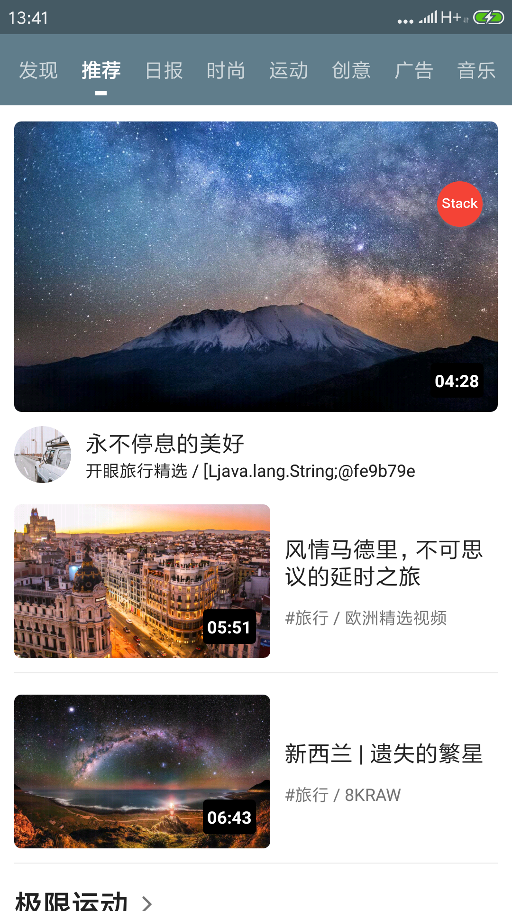
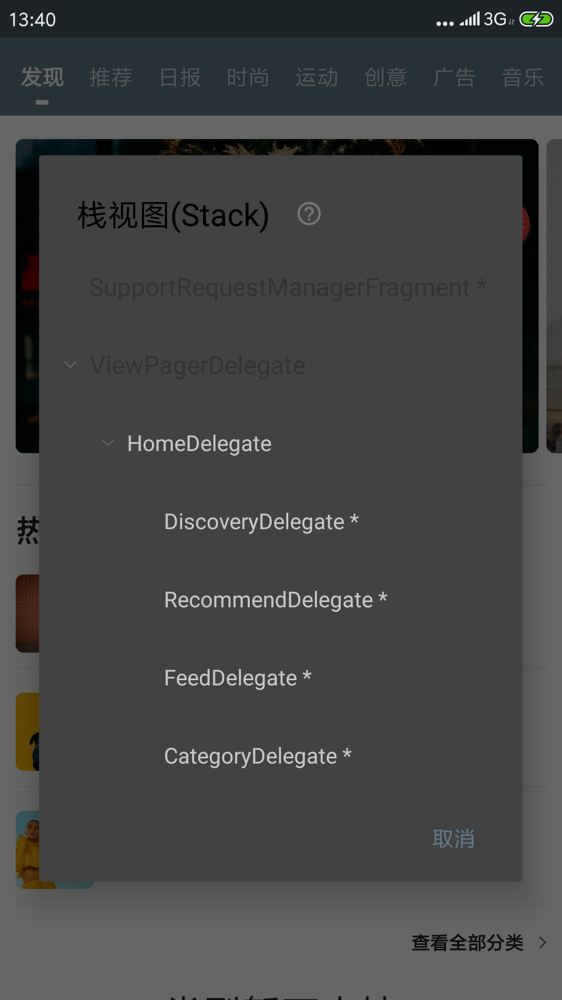

# Lequ_kotlin

原生开发的空间确实越来越小，以至于一些名义大V都在卖焦虑，天天公众号、博客上喊着Android已凉，许多人迷茫着该不该继续坚持下去。坚持下去是对是错并不评论，记得《哈利波特》里面，邓布利多校长对哈利说，在这人世当中，我们面对的大多数选择，并不是 The right way, or the wrong way。（正确的，还是错误的）我们真正面临的选择是：The right way, or the easy way。（正确的，还是容易的）

#### 项目截图：

   

开发语言选的**Kotlin**，毕竟现在Google官方项目都开始用Kotlin写了

**Iconify**，用起来还是挺方便的，有很多矢量icon可用

https://github.com/JoanZapata/android-iconify

**RxJava、Retrofit、RxLifecycle、Glide**

基本上用烂的框架、Retrofit做了些处理，支持动态替换BaseUr，参考[JessYanCoding](https://github.com/JessYanCoding)的 https://github.com/JessYanCoding/RetrofitUrlManager。

**Fragmentation**

国人的框架，很优秀 https://github.com/YoKeyword/Fragmentation

本项目也是采用单一的Activity+多Fragment的结构，尝试过后绝对有想不到的收货哟！看看截图，树的结构是不是非常清晰。

#### 架构方面MVP+组件化

目前也正在研究Google官方ViewModel和LiveData，在后期考虑加入到此项目中，或者开发v2.0版
